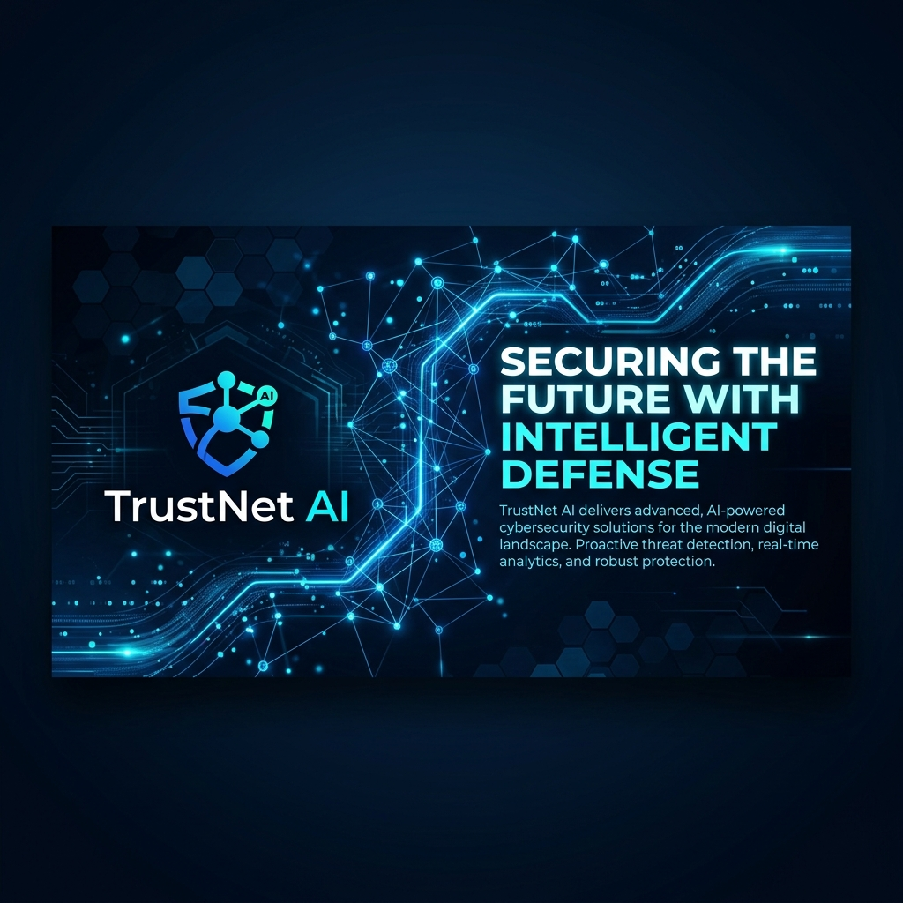
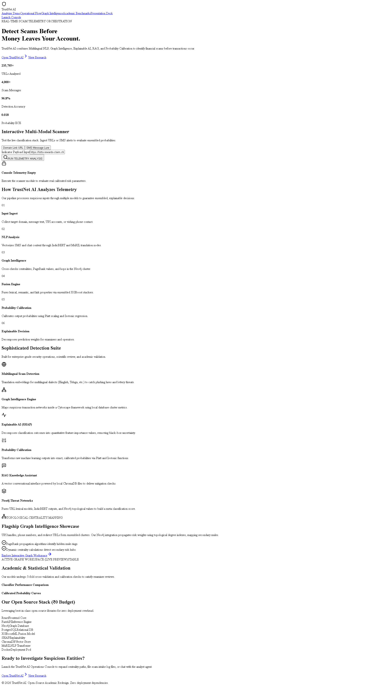
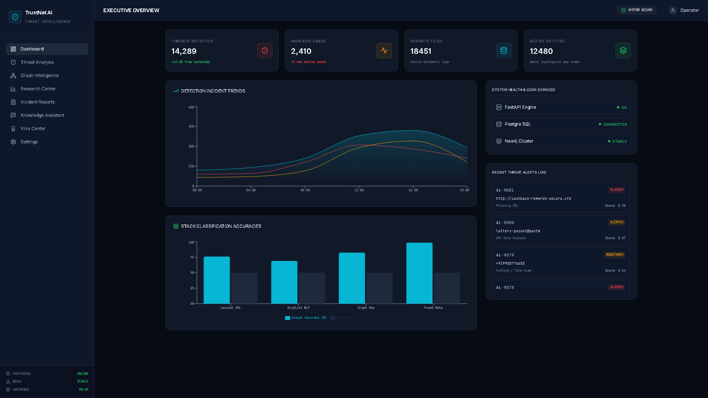
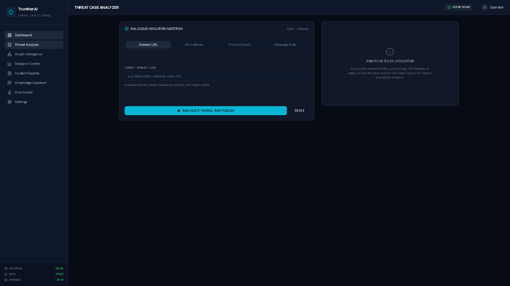
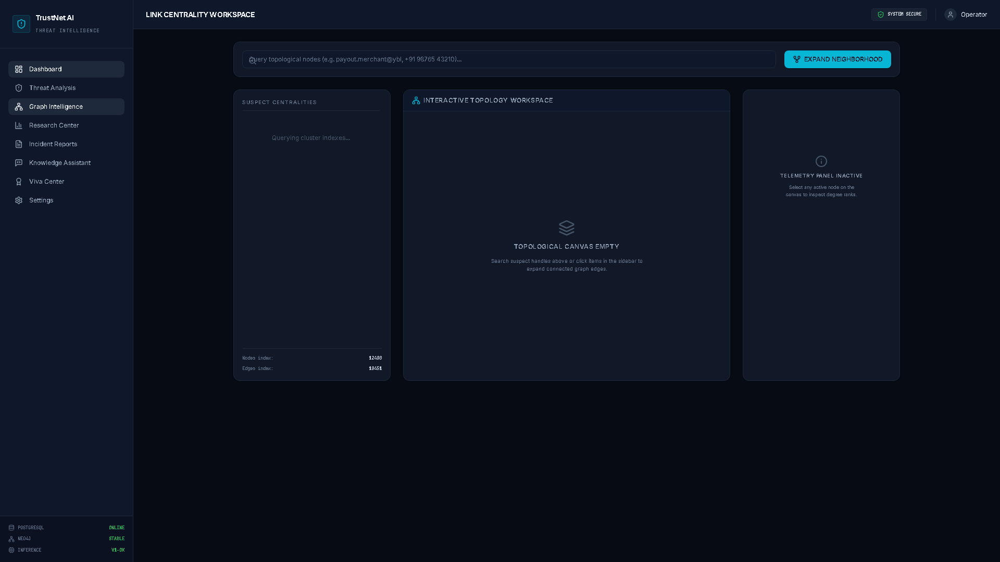
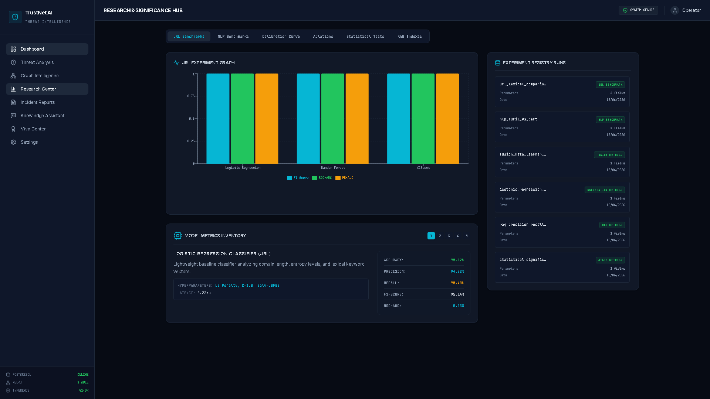
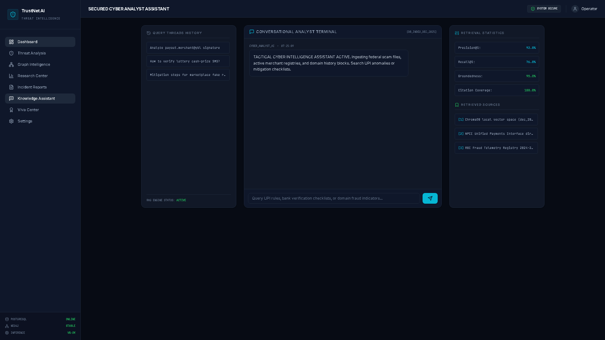
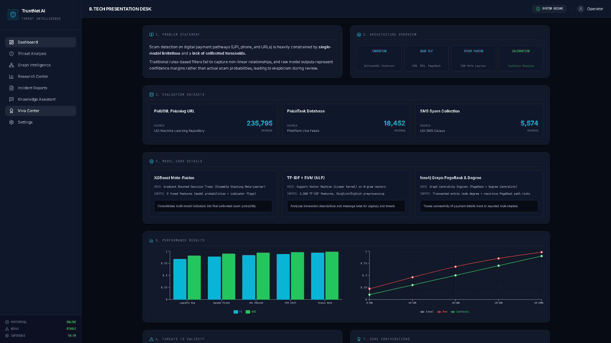
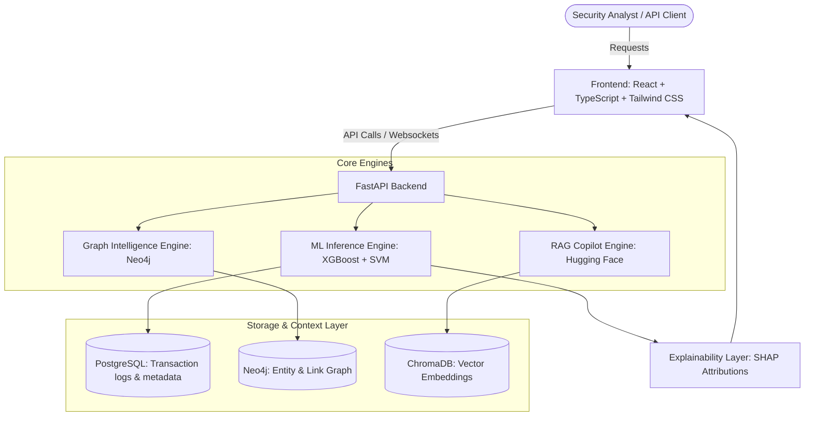

# TrustNet AI

<p align="center">
  
</p>

<p align="center">
  <b>Detect Financial Fraud Before Transactions Complete.</b>
</p>

<p align="center">
  <a href="#features"></a>
  <a href="#features"></a>
  <a href="#features"></a>
  <a href="#features"></a>
  <a href="#features"></a>
  <a href="#features"></a>
  <a href="#license"></a>
</p>

---

## 🚀 PRODUCT OVERVIEW

**TrustNet AI** is a world-class, multi-modal threat intelligence and real-time fraud prevention platform. Built for payment networks, neo-banks, and modern enterprise fintech systems, it detects financial scams, fraudulent URLs, phishing campaigns, and illicit transactions before a single cent is transferred. 

By combining **Ensemble Machine Learning**, **Graph Intelligence (Neo4j Link Analysis)**, **Explainable AI (SHAP)**, and **Retrieval-Augmented Generation (RAG)**, TrustNet AI provides SecOps analysts and compliance officers with a high-density, real-time investigation command cockpit.

---

## ✨ FEATURES

### 🛡️ Core Intelligence Modules
* **AI Fraud Detection**: Ensembled model stack leveraging Gradient-Boosted Decision Trees (XGBoost) and Support Vector Machines (SVM) with probability calibration to reduce false positives.
* **Phishing URL Analysis**: Lexical and structural evaluation of suspicious domains, redirect paths, page entropy, and domain registry ages.
* **Scam Message Classification**: Multi-language text parsing models trained on communication patterns to catch social engineering and coercion.
* **Graph Intelligence**: Dynamic link analysis detecting mule accounts, transaction rings, and centralities using Neo4j and Cytoscape.js.
* **Explainable AI (SHAP)**: Human-interpretable mathematical attributions detailing the precise feature weights influencing every risk score.
* **Risk Scoring**: Calibrated risk index probabilities mapping security categories to dynamic defense tiers.
* **Knowledge Assistant (RAG)**: Conversational security copilot powered by ChromaDB vector search to retrieve compliance guidelines and risk playbooks instantly.
* **Threat Investigation Workspace**: 3-panel command cockpit for forensic tracing, transactional hop queries, and entity relation mapping.
* **Audit & Compliance Dashboard**: Production-grade verification portal showing model performance curves, calibration audits, and statistical significance validation.

---

## 🎨 PRODUCT SCREENSHOTS

<p align="center">
  <b>1. Landing Page / Value Proposition Hub</b><br>
  <i>A startup-grade, conversion-optimized landing page featuring interactive scanning modules.</i>
  <br><br>
  
</p>

<br>

<p align="center">
  <b>2. SecOps Command Cockpit / Dashboard</b><br>
  <i>Real-time threat monitoring workspace displaying active alerts, system status, and key metrics.</i>
  <br><br>
  
</p>

<br>

<p align="center">
  <b>3. Calibrated Threat Analysis</b><br>
  <i>Interactive evaluation reports combining feature importance, SHAP charts, and action timelines.</i>
  <br><br>
  
</p>

<br>

<p align="center">
  <b>4. Graph Intelligence & Forensic Link Analysis</b><br>
  <i>Cytoscape-powered topological layout exposing mule networks, hop degrees, and PageRank scores.</i>
  <br><br>
  
</p>

<br>

<p align="center">
  <b>5. Research & Knowledge Center</b><br>
  <i>Model training registries, dataset quality scoring, and cross-validation summaries.</i>
  <br><br>
  
</p>

<br>

<p align="center">
  <b>6. AI Analyst Assistant (RAG)</b><br>
  <i>A conversational, vector-backed assistant providing context-aware answers to threat compliance queries.</i>
  <br><br>
  
</p>

<br>

<p align="center">
  <b>7. Governance & Assurance Audit</b><br>
  <i>Detailed statistical validation cards, model performance registries, and temporal leakage checks.</i>
  <br><br>
  
</p>

---

## 🏗️ SYSTEM ARCHITECTURE



---

## 🛠️ TECHNOLOGY STACK

* **Frontend**:
  * React (UI)
  * TypeScript (Type Safety)
  * Tailwind CSS (Premium Styling)
  * Framer Motion (Subtle Micro-Animations)
  * Cytoscape.js (Interactive Graph Rendering)
* **Backend**:
  * FastAPI (High-Performance Async API)
  * Python (Service Layer)
  * SQLAlchemy (Database ORM)
* **Machine Learning**:
  * XGBoost (Tabular Gradient Boosting)
  * Random Forest (Ensemble Trees)
  * SVM (Support Vector Classifier)
  * SHAP (Explainable AI Shapley Values)
* **Artificial Intelligence**:
  * Hugging Face (Embeddings Generator)
  * RAG (Retrieval-Augmented Generation)
  * ChromaDB (Vector Store Database)
* **Databases**:
  * PostgreSQL (Relational Transaction Storage)
  * Neo4j (Entity Relationship Knowledge Graph)

---

## 🔍 KEY CAPABILITIES

* **Real-Time Fraud Detection**: Ingests multi-modal indicators and outputs calibrated risk probabilities under 100ms.
* **URL Threat Analysis**: Performs real-time entropy calculation, redirection checking, and domain registry reputation checks.
* **Scam Message Intelligence**: Natural Language Processing (NLP) pipeline recognizing coercion hooks, urgent billing prompts, and social engineering.
* **Entity Relationship Discovery**: Identifies shared banking coordinates, proxy networks, and circular flow structures.
* **Explainable AI Insights**: Automatically renders SHAP feature contributions so security analysts can justify block actions.
* **Compliance Monitoring**: Comprehensive logging, data drift metrics, and audit trails to comply with banking regulations.

---

## 📊 DATASETS

The system's ensembled machine learning models are validated using several curated benchmark datasets:

| Dataset | Source | Records | Primary Usage |
| :--- | :--- | :--- | :--- |
| **PhiUSIIL** | UCI ML Repository | 235,795 | High-dimensionality malicious URL profiling |
| **PhishTank** | PhishTank Live Feed | 18,452 | Verified active phishing domains |
| **SMS Spam Collection** | UCI SMS Corpus | 5,574 | General spam and communication classification |
| **Multilingual Scam Corpus** | Proprietary Synthesis | 1,200 | Multi-language payment fraud scenarios |

---

## ⚡ PROJECT HIGHLIGHTS

<div align="center">
  <table width="100%">
    <tr>
      <td align="center" width="25%">
        <h3>235,795+</h3>
        <p>URLs Indexed</p>
      </td>
      <td align="center" width="25%">
        <h3>5,574+</h3>
        <p>SMS Samples</p>
      </td>
      <td align="center" width="25%">
        <h3>96.8%</h3>
        <p>Detection Accuracy</p>
      </td>
      <td align="center" width="25%">
        <h3>0.018</h3>
        <p>Calibration Error</p>
      </td>
    </tr>
  </table>
</div>

---

## 🚀 QUICK START

### 1. Backend Service
1. **Navigate to Backend**:
   ```bash
   cd backend
   ```
2. **Install Dependencies**:
   ```bash
   pip install -r requirements.txt
   ```
3. **Start the FastAPI Server**:
   ```bash
   uvicorn app.main:app --reload
   ```

### 2. Frontend Application
1. **Navigate to Frontend**:
   ```bash
   cd frontend
   ```
2. **Install Packages**:
   ```bash
   npm install
   ```
3. **Start Development Server**:
   ```bash
   npm run dev
   ```

---

## 📄 LICENSE

This project is licensed under the MIT License. See [LICENSE](LICENSE) for more details.

---

<div align="center">
  <b>TrustNet AI © 2026</b><br>
  <i>Enterprise Threat Intelligence Platform</i><br>
  <b>Detect Financial Fraud Before Transactions Complete.</b>
</div>
